<div align="center">

# 📐 LaTeX Portfolio — DEMAT UG

**Ricardo León Martínez**  
Departamento de Matemáticas · Universidad de Guanajuato


</div>

---

Colección de documentos que muestran lo que puedo hacer con LaTeX, producidos durante mi carrera en el **DEMAT-UG**. Mi fuerte son las **figuras matemáticas**: aquí están las 215 que he hecho, además de portadas, libros y presentaciones. Todo está hecho **100 % en código**, sin imágenes externas ni editores gráficos. Cada carpeta incluye el `.tex` fuente y el `.pdf` compilado.

### En números

| | |
|---|---|
| 📚 Notas tipo libro | **4 documentos**, el más grande con **475 páginas** y **16 000+ líneas** de LaTeX |
| 🎨 Figuras TikZ/PGFPlots | **215 figuras standalone**, cada una con su código ([ver galería](galeria/README.md)) |
| 🖼️ Portadas | **13 portadas** diseñadas desde cero en TikZ |
| 📦 Paquetes propios | `ugmath.sty`, `ugmath_notas.sty`, `ugfisica.sty`, `graficas.sty` |

---

## 🗂️ Estructura

```
Portafolio/
├── galeria/         ← 215 figuras standalone por materia + catálogo PDF
├── portadas/        ← Portadas construidas 100 % en TikZ (pdfLaTeX y XeLaTeX)
├── notas/           ← Documentos tipo libro (multi-capítulo, cientos de páginas)
├── variantes/       ← Un mismo libro en tres estilos cambiando solo el .sty
├── presentaciones/  ← Slides con Beamer
├── proyectos/       ← Solucionarios y proyectos personales
├── tareas/          ← Tareas representativas por materia
├── ugmath/          ← Paquete personal (.sty)
└── assets/          ← Vistas previas PNG usadas en este README
```

---

## 🎨 `galeria/` — 215 figuras

**Esto es el corazón del portafolio.** Todas las figuras que hice para mis notas y tareas, como archivos `standalone`: cada `.tex` compila por sí solo y produce un PDF vectorial.

📄 **[Catálogo completo en PDF](galeria/catalogo.pdf)**: las 215 figuras en un solo documento, generado con LaTeX.

| Materia | Figuras | Qué muestra |
|---|---:|---|
| [**Cálculo I**](galeria/calculo-I/README.md) | 81 | PGFPlots con estilos propios (`graficas.sty`): límites ε–δ, asíntotas, extremos, Taylor, valor medio |
| [**Termodinámica**](galeria/termodinamica/README.md) | 45 | Diagramas físicos en TikZ y superficies 3D con `\addplot3` |
| [**Álgebra Lineal II**](galeria/algebra-lineal-II/README.md) | 32 | Geometría vectorial 2D/3D, tikz-cd, Gerschgorin, SVD |
| [**Teoría analítica de números**](galeria/teoria-numeros/README.md) | 21 | Contornos de integración, retículas, regiones bajo hipérbolas |
| [**Trigonométricas e inversas**](galeria/trigonometricas-inversas/README.md) | 12 | Las 12 funciones con ticks en múltiplos de π |
| [**Lógica**](galeria/logica/README.md) | 10 | Grafos y árboles de resolución |
| [**Álgebra Lineal I**](galeria/algebra-lineal-I/README.md) | 7 | Diagramas conmutativos con tikz-cd |
| [**Variable compleja**](galeria/variable-compleja/README.md) | 7 | Plano complejo, forma polar, raíces |

### Algunas de mis favoritas

<table>
<tr>
<td align="center"><a href="galeria/termodinamica/README.md"></a><br><sub>Proceso isentrópico · PGFPlots 3D</sub></td>
<td align="center"><a href="galeria/calculo-I/README.md"></a><br><sub>Polinomios de Taylor de eˣ</sub></td>
<td align="center"><a href="galeria/teoria-numeros/README.md"></a><br><sub>Contorno de Hankel para ζ(s)</sub></td>
</tr>
<tr>
<td align="center"><a href="galeria/calculo-I/README.md"></a><br><sub>Definición ε–δ de límite</sub></td>
<td align="center"><a href="galeria/algebra-lineal-II/README.md"></a><br><sub>Forma cuadrática en ejes rotados</sub></td>
<td align="center"><a href="galeria/termodinamica/README.md"></a><br><sub>Solenoide · <code>decorations.pathmorphing</code></sub></td>
</tr>
<tr>
<td align="center"><a href="galeria/calculo-I/README.md"></a><br><sub>sen x, x y tan x</sub></td>
<td align="center"><a href="galeria/algebra-lineal-II/README.md"></a><br><sub>Discos de Gerschgorin</sub></td>
<td align="center"><a href="galeria/calculo-I/README.md"></a><br><sub>x·sen(1/x) acotada por ±|x|</sub></td>
</tr>
<tr>
<td align="center"><a href="galeria/termodinamica/README.md"></a><br><sub>Sistema compuesto con pistones</sub></td>
<td align="center"><a href="galeria/trigonometricas-inversas/README.md"></a><br><sub>arcsec x por ramas</sub></td>
<td align="center"><a href="galeria/logica/README.md"></a><br><sub>Grafo completo K₈</sub></td>
</tr>
<tr>
<td align="center"><a href="galeria/teoria-numeros/README.md"></a><br><sub>Método de la hipérbola de Dirichlet</sub></td>
<td align="center"><a href="galeria/calculo-I/README.md"></a><br><sub>Teorema del valor medio</sub></td>
<td align="center"><a href="galeria/variable-compleja/README.md"></a><br><sub>Raíces cúbicas de un complejo</sub></td>
</tr>
</table>

👉 **[Ver la galería completa por materia](galeria/README.md)**

---

## 🖼️ `portadas/` — Portadas con TikZ

Diseñadas completamente en TikZ sobre `current page`, sin imágenes externas: todo (gradientes, patrones, diagramas del tema, tipografía) es código.

### Portadas de notas

<table>
<tr>
<td align="center">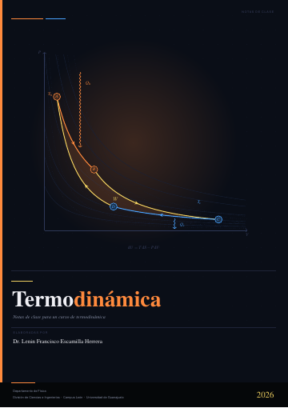<br><sub><b>Termodinámica</b></sub></td>
<td align="center">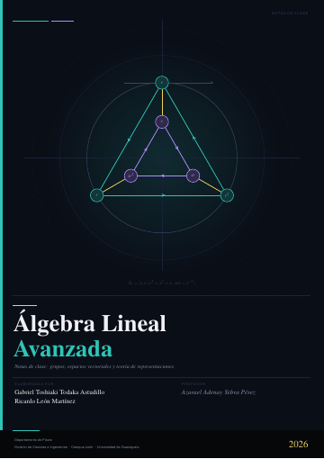<br><sub><b>Álgebra Lineal Avanzada</b></sub></td>
<td align="center">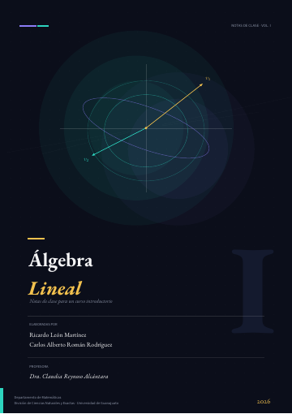<br><sub><b>Álgebra Lineal I</b></sub></td>
<td align="center">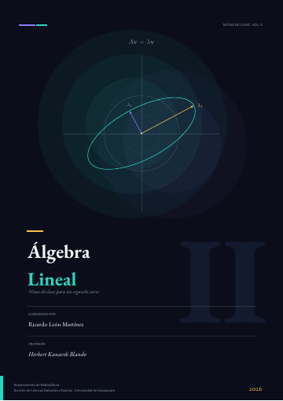<br><sub><b>Álgebra Lineal II</b></sub></td>
</tr>
<tr>
<td align="center">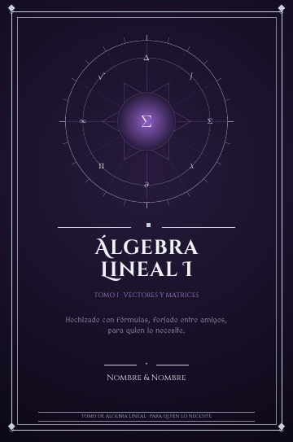<br><sub><b>Grimorio · Álgebra Lineal I</b><br>XeLaTeX</sub></td>
<td align="center">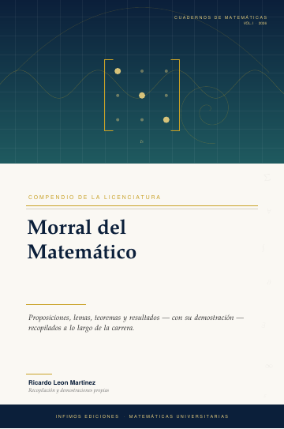<br><sub><b>Morral del Matemático</b><br>XeLaTeX</sub></td>
<td align="center">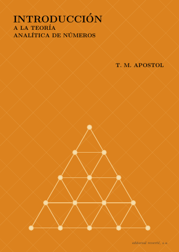<br><sub><b>Teoría analítica de números</b></sub></td>
<td align="center">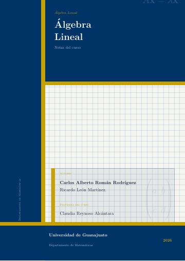<br><sub><b>Álgebra Lineal (clásica)</b></sub></td>
</tr>
</table>

| Carpeta | Técnica destacada |
|---|---|
| `termodinamica/` | **Ciclo de Carnot calculado**: isotermas `PV = c` y adiabatas `PV^γ = k` generadas con `\pgfmathsetmacro` + `plot`, brillo radial detrás del diagrama |
| `algebra-lineal-avanzada/` | Grafo geométrico con `\foreach`, rejilla de puntos, acentos con `shade` |
| `algebra-lineal-I/`, `algebra-lineal-II/` | Elipses y transformaciones lineales rotadas; EB Garamond + Source Sans |
| `grimorio-algebra-lineal/` | **XeLaTeX + `fontspec`** con fuentes TTF locales (Cinzel, MedievalSharp); estrella con `shapes.geometric` y halo radial |
| `morral-del-matematico/` | **XeLaTeX**, TeX Gyre Pagella/Heros, retícula de puntos con `clip` y líneas rotadas |
| `teoria-numeros/` | Estilo libro clásico |
| `algebra-lineal/` | Panel lateral + cuadrícula matemática de fondo |

### Portadas de tareas

Un mismo sistema visual (franjas institucionales azul/dorado) con un diagrama distinto por materia.

<table>
<tr>
<td align="center">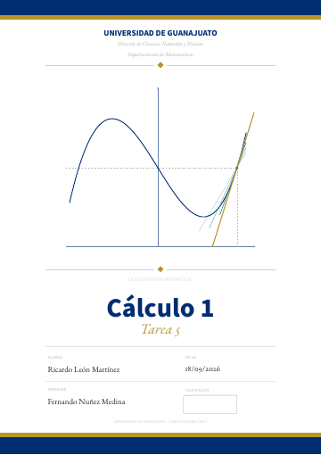<br><sub>Cálculo I · <code>pgfplots</code></sub></td>
<td align="center">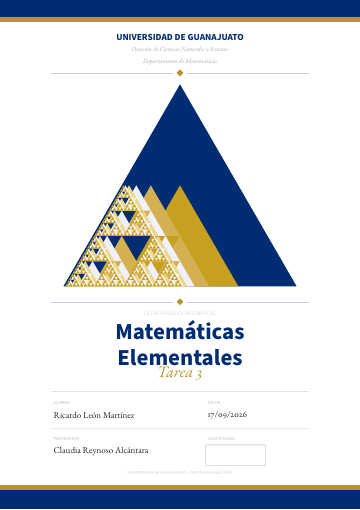<br><sub>Mat. Elementales · triángulo de Sierpinski</sub></td>
<td align="center">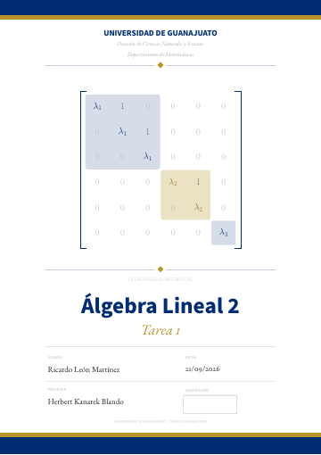<br><sub>Álgebra Lineal II · forma de Jordan</sub></td>
<td align="center">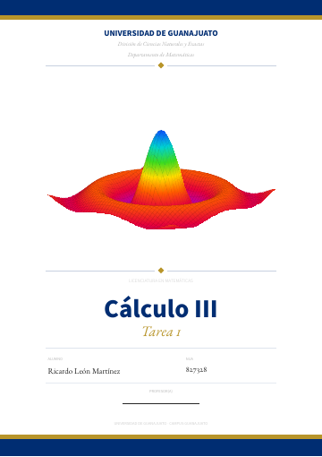<br><sub>Cálculo 3</sub></td>
<td align="center">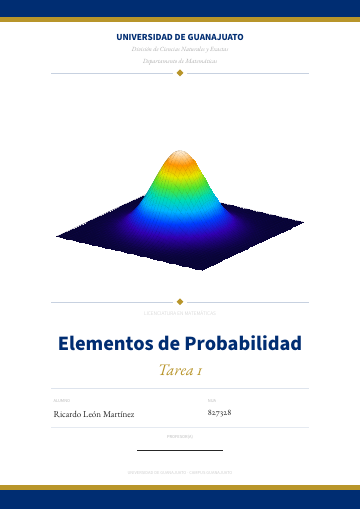<br><sub>Probabilidad</sub></td>
</tr>
</table>

---

## 📚 `notas/` — Documentos tipo libro

Notas de clase en formato `book`, con portada integrada vía `pdfpages`.

<table>
<tr>
<td width="50%" valign="top">

**`algebra-lineal-II/`** — 475 páginas

- **16 386 líneas** en un solo `main.tex`
- **32 figuras** standalone en `figuras/`
- Paquete propio `ugmath_notas.sty`
- Diagonalización, espacios con producto interno, formas cuadráticas, cadenas de Márkov, SVD, modelo de Leontief

</td>
<td align="center">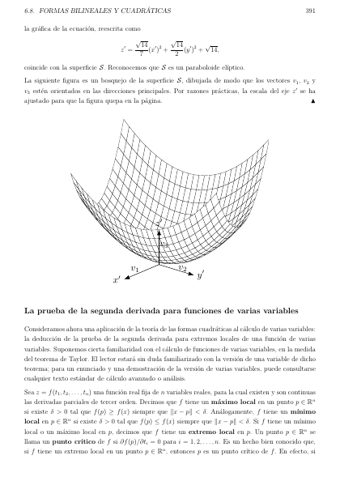</td>
</tr>
<tr>
<td width="50%" valign="top">

**`termodinamica/`** — 97 páginas

- Proyecto **multi-archivo**: `\input{capitulos/...}` con 6 capítulos
- **45 figuras** standalone (PGFPlots 3D + TikZ)
- **`biblatex` + `biber`** con bibliografía dividida por palabra clave (básica / complementaria)
- Paquete propio `ugfisica.sty` con cajas para *modelo → definición → ley → resultado → ejemplo*
- Estilo de capítulos con `titlesec`

</td>
<td align="center">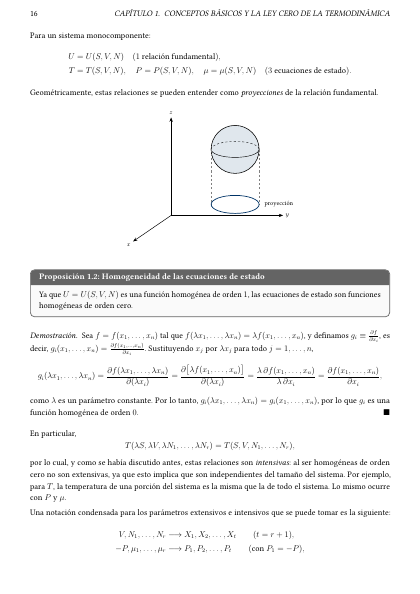</td>
</tr>
</table>

**`algebra-lineal/`** — Álgebra Lineal I: +170 KB de LaTeX, diagramas conmutativos con `tikz-cd`, macros de notación (`\rg`, `\Tr`, `\parentesis`, `\corchetes`).

**`fisica-I/`** — Estructura libro con capítulos por tema y figuras externas integradas.

### Compilar

```bash
cd notas/termodinamica
pdflatex termodinamica.tex && biber termodinamica && pdflatex termodinamica.tex
```

---

## 🌗 `variantes/` — Un libro, tres estilos

Las notas de Álgebra Lineal I en tres versiones **cambiando únicamente el archivo `ugmath.sty`**; el contenido matemático es el mismo. Muestra la separación entre contenido y presentación.

<table>
<tr>
<td align="center">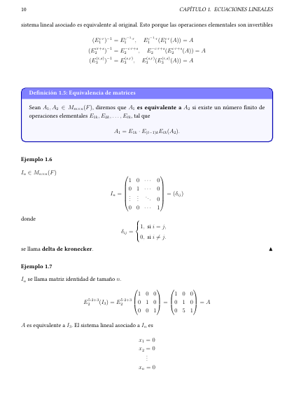<br><sub><b>Original</b> — cajas de color<br><code>notas/algebra-lineal/</code></sub></td>
<td align="center">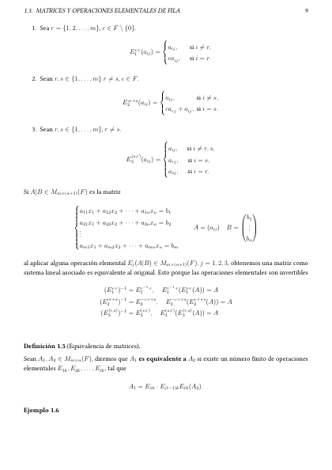<br><sub><b>Impresión</b> — sin cajas, estilo libro clásico<br><code>variantes/algebra-lineal/impresion/</code></sub></td>
<td align="center">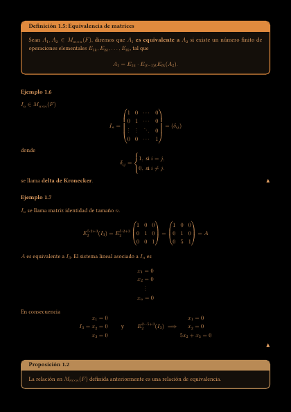<br><sub><b>Modo oscuro</b> — hoja negra, paleta ámbar<br><code>variantes/algebra-lineal/modo-oscuro/</code></sub></td>
</tr>
</table>

---

## 📊 `presentaciones/` — Beamer

**`fisica-cuerpo-rigido/`** — Dinámica del Cuerpo Rígido (Física I)

<table>
<tr>
<td align="center">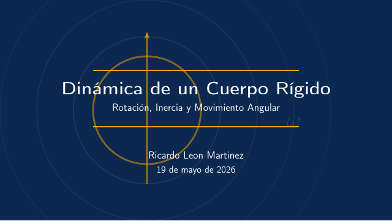</td>
<td align="center">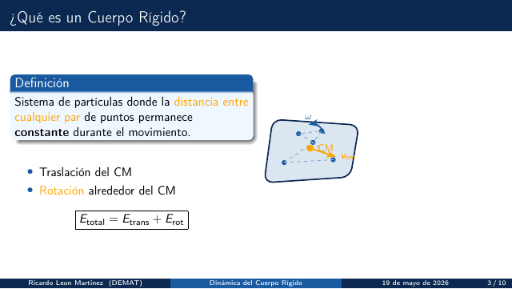</td>
<td align="center">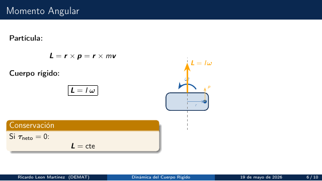</td>
</tr>
</table>

- Tema Madrid con paleta completamente redefinida (azul oscuro `#0A2850` + naranja `#FFA500`)
- Diagramas vectoriales en TikZ con `arrows.meta`, `3d`, `angles`, `quotes`
- Macros vectoriales (`\vL`, `\vomega`, `\vtau`…) para notación limpia
- Formato widescreen `aspectratio=169`
- Fondo de portada generado íntegramente en TikZ

---

## 🔬 `proyectos/` — Proyectos personales

**`solucionario-calculo-I/`** — Solucionario personal del curso de Cálculo I. Formato libro, iniciado en vacaciones para reforzar el material. Portada propia.

**`problemas-taller/`** — Problemas de competencia de cálculo. Documento tipo artículo con problemas y soluciones completas.

**`teoria-analitica-numeros/`** — Notas sobre *Introduction to Analytic Number Theory* de Apostol. Proyecto independiente fuera de la currícula, con las figuras de contornos y retículas de la galería.

---

## 🧮 `tareas/` — Tareas representativas

Una o dos tareas por materia, seleccionadas por riqueza técnica:

| Carpeta | Qué muestra en LaTeX |
|---|---|
| `algebra-lineal/tarea-3` | Uso intensivo de entornos matriciales (`pmatrix`, `bmatrix`, `vmatrix`) — 46 matrices en un solo documento |
| `algebra-lineal/tarea-12` | Combinación de matrices y demostraciones largas con entornos personalizados |
| `calculo-II/tarea-5` | Demostraciones formales largas con `proof`, cajas `mdframed` |
| `calculo-II/tarea-12` | Documento de 500+ líneas, estructura con múltiples ejercicios |
| `calculo-I/tarea-10` | Gráficas con `pgfplots` + `tikzpicture` dentro de soluciones |
| `fisica-I/tarea-3` | Ecuaciones de movimiento, notación vectorial con `physics` |
| `fisica-I/tarea-6` | Tarea más extensa de Física, múltiples problemas |
| `probabilidad/tarea-10` | Tablas de distribuciones, fórmulas de probabilidad |
| `termodinamica/reto-1`, `reto-2` | Retos de termodinámica con entorno `problema` propio y encabezado institucional |

---

## 📦 `ugmath/` — Paquete personal

`ugmath.sty` es un paquete LaTeX propio que centraliza el estilo de mis documentos:

- Fuente **Libertinus** + `microtype` para tipografía refinada
- Colores institucionales UG (`#003366` azul, `#D4AF37` dorado)
- Cajas con `mdframed` + TikZ para teoremas, definiciones, soluciones y ejemplos
- Entornos `amsthm` personalizados: `theorem`, `definition`, `proof`, `solucion`
- `pgfplots`, `tikz-3dplot`, `physics`, `mathtools` preconfigurados
- Márgenes y espaciado listos para imprimir

Derivados: `ugmath_notas.sty` (notas largas), `ugfisica.sty` (notas de física) y `graficas.sty` (estilos PGFPlots compartidos por las 81 figuras de Cálculo I).

---

## 🛠️ Compilar

La mayoría de los documentos usan `pdflatex`; cada carpeta incluye su propia copia del `.sty` que necesita.

```bash
cd galeria/termodinamica
pdflatex plano-S0.tex
```

Excepciones:

- `galeria/calculo-I/` → necesita `graficas.sty` (incluido en la carpeta).

- `portadas/grimorio-algebra-lineal/` y `portadas/morral-del-matematico/` → **`xelatex`** (el grimorio carga sus fuentes desde `fonts/`).
- `notas/termodinamica/` → `pdflatex` + **`biber`** (ver arriba).

---

## 📬 Contacto

**GitHub:** [@jayss1e](https://github.com/jayss1e)  
**Instagram:** [@anillo_conmutativo](https://www.instagram.com/anillo_conmutativo)  
**Correo:** ricardoleonmartinez623 [at] gmail.com

---

<div align="center">
  <sub>Hecho con ❤️ y muchas horas de <code>Overfull \hbox</code></sub>
</div>
