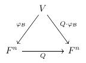
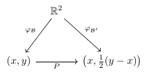
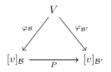
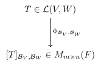
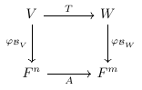
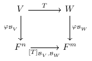
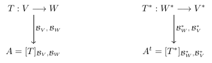

# Álgebra Lineal I

**7 figuras** · Origen: Notas de Álgebra Lineal I

Diagramas conmutativos con **tikz-cd**: cambio de base, representación matricial, isomorfismo Φ y transformación dual.

Haz clic en una miniatura para abrir el PDF vectorial; el nombre lleva al código `.tex`.

[← Volver a la galería](../README.md)

<table>
<tr>
<td align="center" width="25%"> <a href="diagrama-cambio-base-Q.tex"><code>diagrama-cambio-base-Q</code></a></td>
<td align="center" width="25%"> <a href="diagrama-cambio-base-ejemplo.tex"><code>diagrama-cambio-base-ejemplo</code></a></td>
<td align="center" width="25%"> <a href="diagrama-cambio-base-triangulo.tex"><code>diagrama-cambio-base-triangulo</code></a></td>
<td align="center" width="25%"> <a href="diagrama-isomorfismo-Phi.tex"><code>diagrama-isomorfismo-Phi</code></a></td>
</tr>
<tr>
<td align="center" width="25%"> <a href="diagrama-representacion-A.tex"><code>diagrama-representacion-A</code></a></td>
<td align="center" width="25%"> <a href="diagrama-representacion-T.tex"><code>diagrama-representacion-T</code></a></td>
<td align="center" width="25%"> <a href="diagrama-transformacion-dual.tex"><code>diagrama-transformacion-dual</code></a></td>
</tr>
</table>
