# Álgebra Lineal II

**32 figuras** · Origen: Notas de Álgebra Lineal II

Geometría vectorial en 2D y 3D con **TikZ** (`arrows.meta`, `calc`), diagramas conmutativos con **tikz-cd**, discos de Gerschgorin, valores singulares y un paraboloide con PGFPlots.

Haz clic en una miniatura para abrir el PDF vectorial; el nombre lleva al código `.tex`.

[← Volver a la galería](../README.md)

<table>
<tr>
<td align="center" width="25%"><a href="6-3-minimos-cuadrados.pdf">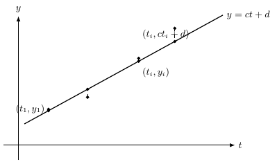</a> <a href="6-3-minimos-cuadrados.tex"><code>6-3-minimos-cuadrados</code></a></td>
<td align="center" width="25%"><a href="6-5-elipse-ejes-rotados.pdf">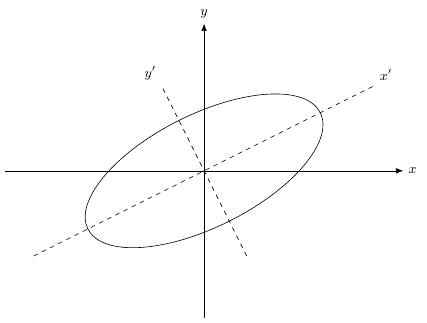</a> <a href="6-5-elipse-ejes-rotados.tex"><code>6-5-elipse-ejes-rotados</code></a></td>
<td align="center" width="25%"><a href="6-6-proyeccion-ortogonal-vs-oblicua.pdf">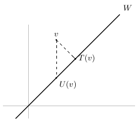</a> <a href="6-6-proyeccion-ortogonal-vs-oblicua.tex"><code>6-6-proyeccion-ortogonal-vs-oblicua</code></a></td>
<td align="center" width="25%"><a href="6-7-circulo-elipse-valores-singulares.pdf">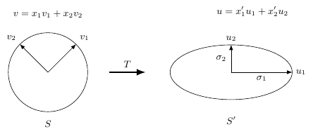</a> <a href="6-7-circulo-elipse-valores-singulares.tex"><code>6-7-circulo-elipse-valores-singulares</code></a></td>
</tr>
<tr>
<td align="center" width="25%"><a href="6-8-paraboloide-eliptico.pdf">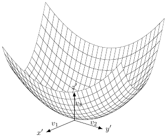</a> <a href="6-8-paraboloide-eliptico.tex"><code>6-8-paraboloide-eliptico</code></a></td>
<td align="center" width="25%"><a href="accion-vector-propio.pdf">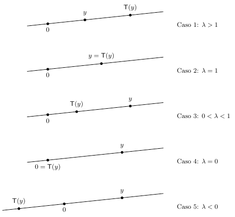</a> <a href="accion-vector-propio.tex"><code>accion-vector-propio</code></a></td>
<td align="center" width="25%"><a href="angulo-entre-vectores.pdf">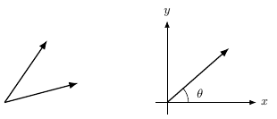</a> <a href="angulo-entre-vectores.tex"><code>angulo-entre-vectores</code></a></td>
<td align="center" width="25%"><a href="cadena-ciudad-suburbios.pdf">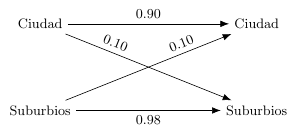</a> <a href="cadena-ciudad-suburbios.tex"><code>cadena-ciudad-suburbios</code></a></td>
</tr>
<tr>
<td align="center" width="25%"><a href="diagrama-cociente-T-barra.pdf">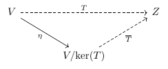</a> <a href="diagrama-cociente-T-barra.tex"><code>diagrama-cociente-T-barra</code></a></td>
<td align="center" width="25%"><a href="diagrama-doble-dual.pdf">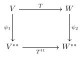</a> <a href="diagrama-doble-dual.tex"><code>diagrama-doble-dual</code></a></td>
<td align="center" width="25%"><a href="diagrama-phi-beta-LA.pdf">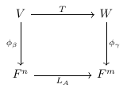</a> <a href="diagrama-phi-beta-LA.tex"><code>diagrama-phi-beta-LA</code></a></td>
<td align="center" width="25%"><a href="diagrama-valores-propios.pdf">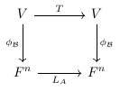</a> <a href="diagrama-valores-propios.tex"><code>diagrama-valores-propios</code></a></td>
</tr>
<tr>
<td align="center" width="25%"><a href="discos-gerschgorin.pdf">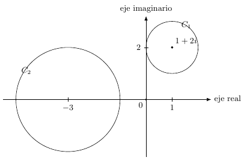</a> <a href="discos-gerschgorin.tex"><code>discos-gerschgorin</code></a></td>
<td align="center" width="25%"><a href="distancia-punto-plano.pdf">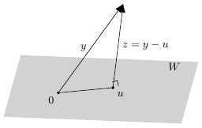</a> <a href="distancia-punto-plano.tex"><code>distancia-punto-plano</code></a></td>
<td align="center" width="25%"><a href="elipse-cambio-coordenadas.pdf">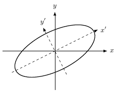</a> <a href="elipse-cambio-coordenadas.tex"><code>elipse-cambio-coordenadas</code></a></td>
<td align="center" width="25%"><a href="generado-por-dos-vectores.pdf">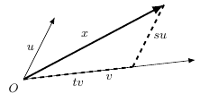</a> <a href="generado-por-dos-vectores.tex"><code>generado-por-dos-vectores</code></a></td>
</tr>
<tr>
<td align="center" width="25%"><a href="gram-schmidt-paso.pdf">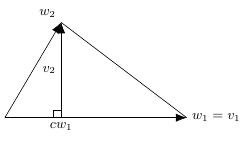</a> <a href="gram-schmidt-paso.tex"><code>gram-schmidt-paso</code></a></td>
<td align="center" width="25%"><a href="ley-paralelogramo.pdf">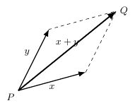</a> <a href="ley-paralelogramo.tex"><code>ley-paralelogramo</code></a></td>
<td align="center" width="25%"><a href="paralelepipedo-tres-vectores.pdf">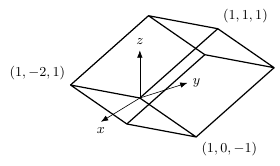</a> <a href="paralelepipedo-tres-vectores.tex"><code>paralelepipedo-tres-vectores</code></a></td>
<td align="center" width="25%"><a href="paralelogramo-altura-comun.pdf">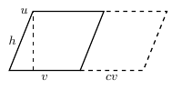</a> <a href="paralelogramo-altura-comun.tex"><code>paralelogramo-altura-comun</code></a></td>
</tr>
<tr>
<td align="center" width="25%"><a href="paralelogramo-diagonal-suma.pdf">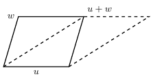</a> <a href="paralelogramo-diagonal-suma.tex"><code>paralelogramo-diagonal-suma</code></a></td>
<td align="center" width="25%"><a href="paralelogramos-u-v.pdf">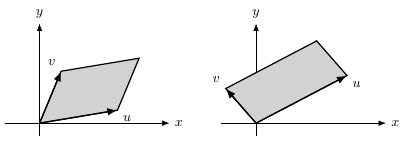</a> <a href="paralelogramos-u-v.tex"><code>paralelogramos-u-v</code></a></td>
<td align="center" width="25%"><a href="pendulo.pdf">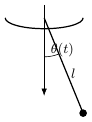</a> <a href="pendulo.tex"><code>pendulo</code></a></td>
<td align="center" width="25%"><a href="plano-por-tres-puntos.pdf">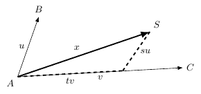</a> <a href="plano-por-tres-puntos.tex"><code>plano-por-tres-puntos</code></a></td>
</tr>
<tr>
<td align="center" width="25%"><a href="recta-por-dos-puntos.pdf">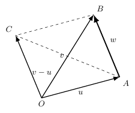</a> <a href="recta-por-dos-puntos.tex"><code>recta-por-dos-puntos</code></a></td>
<td align="center" width="25%"><a href="reflexion-recta-y-2x.pdf">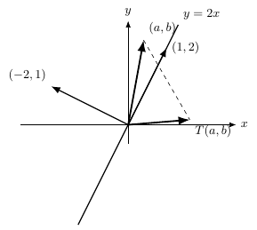</a> <a href="reflexion-recta-y-2x.tex"><code>reflexion-recta-y-2x</code></a></td>
<td align="center" width="25%"><a href="resorte-peso.pdf">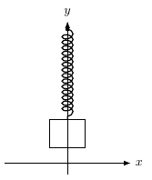</a> <a href="resorte-peso.tex"><code>resorte-peso</code></a></td>
<td align="center" width="25%"><a href="rotacion-reflexion-proyeccion.pdf">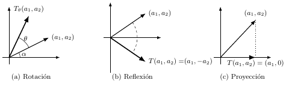</a> <a href="rotacion-reflexion-proyeccion.tex"><code>rotacion-reflexion-proyeccion</code></a></td>
</tr>
<tr>
<td align="center" width="25%"><a href="sistemas-coordenados-relatividad.pdf">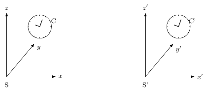</a> <a href="sistemas-coordenados-relatividad.tex"><code>sistemas-coordenados-relatividad</code></a></td>
<td align="center" width="25%"><a href="sistemas-mano-derecha-izquierda.pdf">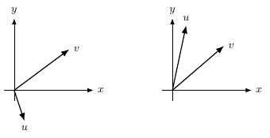</a> <a href="sistemas-mano-derecha-izquierda.tex"><code>sistemas-mano-derecha-izquierda</code></a></td>
<td align="center" width="25%"><a href="suma-y-escalar-coordenadas.pdf">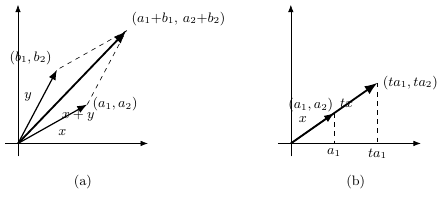</a> <a href="suma-y-escalar-coordenadas.tex"><code>suma-y-escalar-coordenadas</code></a></td>
<td align="center" width="25%"><a href="venn-bases.pdf">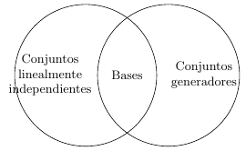</a> <a href="venn-bases.tex"><code>venn-bases</code></a></td>
</tr>
</table>
