# Cálculo I

**81 figuras** · Origen: Notas de Cálculo I (tercer semestre) y Tarea 4

Gráficas de funciones con **PGFPlots** y un paquete propio, `graficas.sty`, que define los estilos `grafica`, `panel`, `punto` y `puntovacio`. Así las 81 figuras comparten el mismo aspecto sin repetir código. Incluye límites ε–δ, asíntotas, extremos, concavidad, teorema del valor medio y polinomios de Taylor.

Haz clic en una miniatura para abrir el PDF vectorial; el nombre lleva al código `.tex`.

[← Volver a la galería](../README.md)

<table>
<tr>
<td align="center" width="25%"><a href="analisis-quintica.pdf">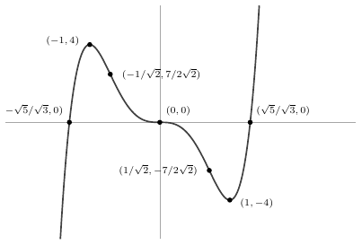</a> <a href="analisis-quintica.tex"><code>analisis-quintica</code></a></td>
<td align="center" width="25%"><a href="asintota-horizontal.pdf">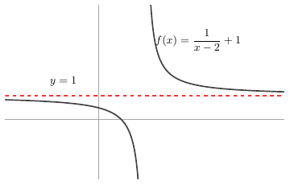</a> <a href="asintota-horizontal.tex"><code>asintota-horizontal</code></a></td>
<td align="center" width="25%"><a href="asintota-oblicua.pdf">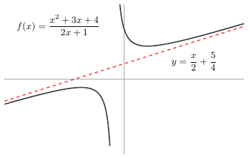</a> <a href="asintota-oblicua.tex"><code>asintota-oblicua</code></a></td>
<td align="center" width="25%"><a href="asintota-vertical.pdf">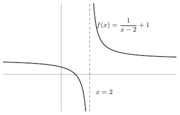</a> <a href="asintota-vertical.tex"><code>asintota-vertical</code></a></td>
</tr>
<tr>
<td align="center" width="25%"><a href="caja.pdf">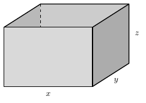</a> <a href="caja.tex"><code>caja</code></a></td>
<td align="center" width="25%"><a href="circunferencia.pdf">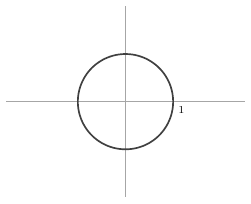</a> <a href="circunferencia.tex"><code>circunferencia</code></a></td>
<td align="center" width="25%"><a href="concavidad-opciones.pdf">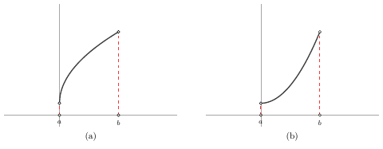</a> <a href="concavidad-opciones.tex"><code>concavidad-opciones</code></a></td>
<td align="center" width="25%"><a href="criterio-primera.pdf">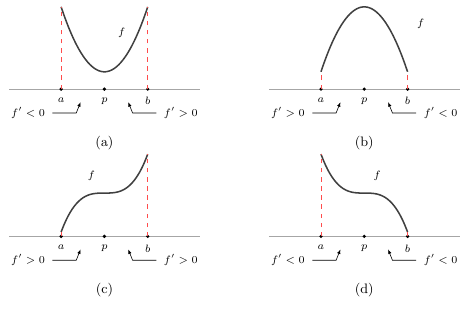</a> <a href="criterio-primera.tex"><code>criterio-primera</code></a></td>
</tr>
<tr>
<td align="center" width="25%"><a href="cuartica-w.pdf">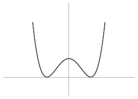</a> <a href="cuartica-w.tex"><code>cuartica-w</code></a></td>
<td align="center" width="25%"><a href="cubica-crece.pdf">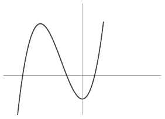</a> <a href="cubica-crece.tex"><code>cubica-crece</code></a></td>
<td align="center" width="25%"><a href="cubica-inflexion.pdf">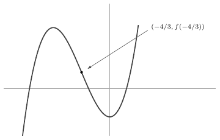</a> <a href="cubica-inflexion.tex"><code>cubica-inflexion</code></a></td>
<td align="center" width="25%"><a href="curva-asintotica.pdf">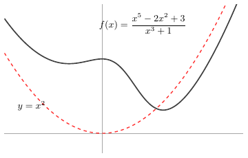</a> <a href="curva-asintotica.tex"><code>curva-asintotica</code></a></td>
</tr>
<tr>
<td align="center" width="25%"><a href="curva-gamma.pdf">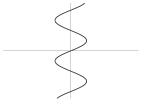</a> <a href="curva-gamma.tex"><code>curva-gamma</code></a></td>
<td align="center" width="25%"><a href="derivada-fisica.pdf">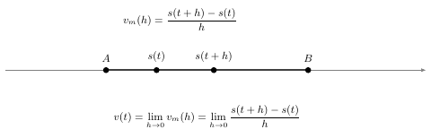</a> <a href="derivada-fisica.tex"><code>derivada-fisica</code></a></td>
<td align="center" width="25%"><a href="derivada-geometrica.pdf">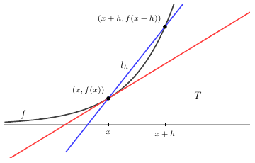</a> <a href="derivada-geometrica.tex"><code>derivada-geometrica</code></a></td>
<td align="center" width="25%"><a href="elipse-tangente.pdf">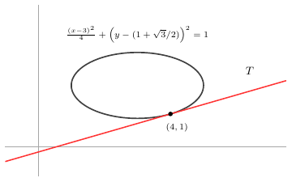</a> <a href="elipse-tangente.tex"><code>elipse-tangente</code></a></td>
</tr>
<tr>
<td align="center" width="25%"><a href="escalon.pdf">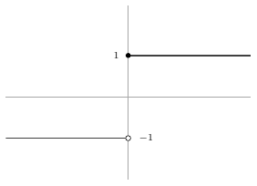</a> <a href="escalon.tex"><code>escalon</code></a></td>
<td align="center" width="25%"><a href="exponencial.pdf">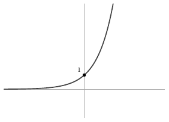</a> <a href="exponencial.tex"><code>exponencial</code></a></td>
<td align="center" width="25%"><a href="extremo-derivada.pdf">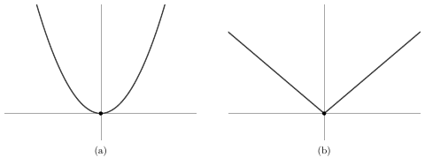</a> <a href="extremo-derivada.tex"><code>extremo-derivada</code></a></td>
<td align="center" width="25%"><a href="extremos-globales-cuartica.pdf">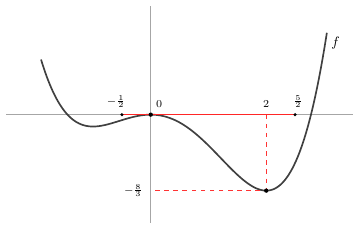</a> <a href="extremos-globales-cuartica.tex"><code>extremos-globales-cuartica</code></a></td>
</tr>
<tr>
<td align="center" width="25%"><a href="extremos-globales-cubica.pdf">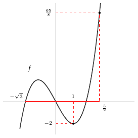</a> <a href="extremos-globales-cubica.tex"><code>extremos-globales-cubica</code></a></td>
<td align="center" width="25%"><a href="extremos-locales.pdf">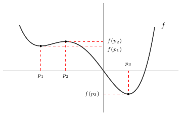</a> <a href="extremos-locales.tex"><code>extremos-locales</code></a></td>
<td align="center" width="25%"><a href="factorizacion.pdf">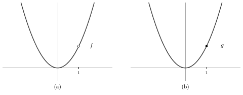</a> <a href="factorizacion.tex"><code>factorizacion</code></a></td>
<td align="center" width="25%"><a href="funcion-acotada.pdf">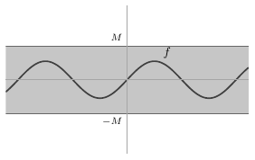</a> <a href="funcion-acotada.tex"><code>funcion-acotada</code></a></td>
</tr>
<tr>
<td align="center" width="25%"><a href="funcion-constante.pdf">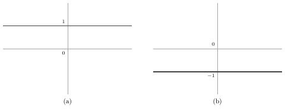</a> <a href="funcion-constante.tex"><code>funcion-constante</code></a></td>
<td align="center" width="25%"><a href="funcion-salto-punto.pdf">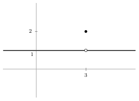</a> <a href="funcion-salto-punto.tex"><code>funcion-salto-punto</code></a></td>
<td align="center" width="25%"><a href="implicita-cubica.pdf">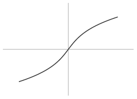</a> <a href="implicita-cubica.tex"><code>implicita-cubica</code></a></td>
<td align="center" width="25%"><a href="inflexion-cubo.pdf">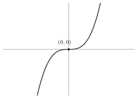</a> <a href="inflexion-cubo.tex"><code>inflexion-cubo</code></a></td>
</tr>
<tr>
<td align="center" width="25%"><a href="inflexion-raiz-cubica.pdf">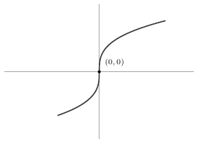</a> <a href="inflexion-raiz-cubica.tex"><code>inflexion-raiz-cubica</code></a></td>
<td align="center" width="25%"><a href="intervalos-finitos.pdf">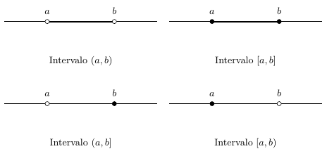</a> <a href="intervalos-finitos.tex"><code>intervalos-finitos</code></a></td>
<td align="center" width="25%"><a href="intervalos-infinitos.pdf">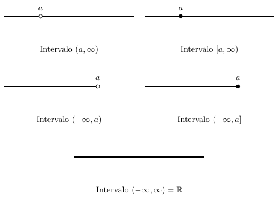</a> <a href="intervalos-infinitos.tex"><code>intervalos-infinitos</code></a></td>
<td align="center" width="25%"><a href="inversas.pdf">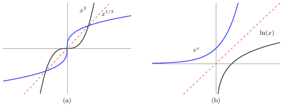</a> <a href="inversas.tex"><code>inversas</code></a></td>
</tr>
<tr>
<td align="center" width="25%"><a href="limite-constante.pdf">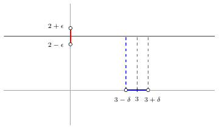</a> <a href="limite-constante.tex"><code>limite-constante</code></a></td>
<td align="center" width="25%"><a href="limite-definicion.pdf">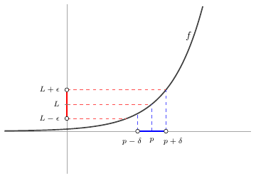</a> <a href="limite-definicion.tex"><code>limite-definicion</code></a></td>
<td align="center" width="25%"><a href="limite-identidad.pdf">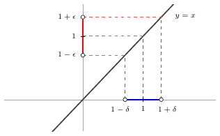</a> <a href="limite-identidad.tex"><code>limite-identidad</code></a></td>
<td align="center" width="25%"><a href="logaritmo.pdf">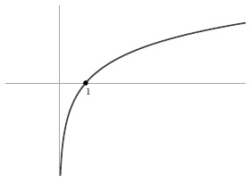</a> <a href="logaritmo.tex"><code>logaritmo</code></a></td>
</tr>
<tr>
<td align="center" width="25%"><a href="monotonas.pdf">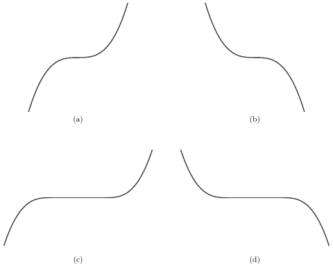</a> <a href="monotonas.tex"><code>monotonas</code></a></td>
<td align="center" width="25%"><a href="no-derivable-salto.pdf">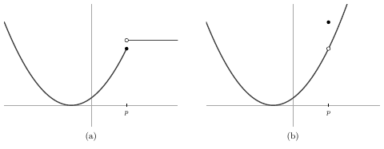</a> <a href="no-derivable-salto.tex"><code>no-derivable-salto</code></a></td>
<td align="center" width="25%"><a href="no-derivable-varios.pdf">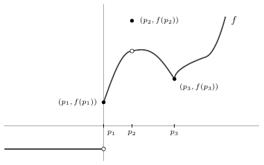</a> <a href="no-derivable-varios.tex"><code>no-derivable-varios</code></a></td>
<td align="center" width="25%"><a href="parabola-horizontal.pdf">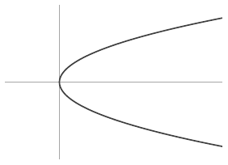</a> <a href="parabola-horizontal.tex"><code>parabola-horizontal</code></a></td>
</tr>
<tr>
<td align="center" width="25%"><a href="paridad-impares.pdf">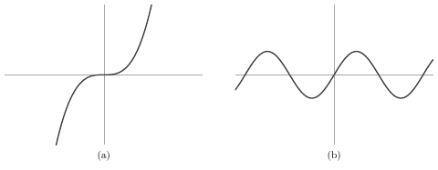</a> <a href="paridad-impares.tex"><code>paridad-impares</code></a></td>
<td align="center" width="25%"><a href="paridad-pares.pdf">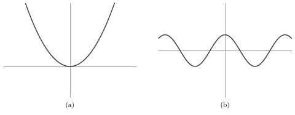</a> <a href="paridad-pares.tex"><code>paridad-pares</code></a></td>
<td align="center" width="25%"><a href="pico-ejemplo.pdf">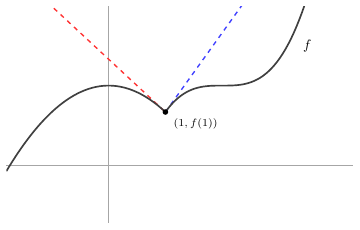</a> <a href="pico-ejemplo.tex"><code>pico-ejemplo</code></a></td>
<td align="center" width="25%"><a href="plano-cartesiano.pdf">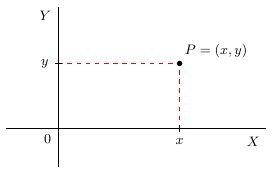</a> <a href="plano-cartesiano.tex"><code>plano-cartesiano</code></a></td>
</tr>
<tr>
<td align="center" width="25%"><a href="postes.pdf">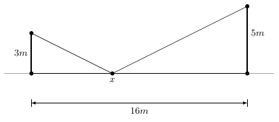</a> <a href="postes.tex"><code>postes</code></a></td>
<td align="center" width="25%"><a href="potencias.pdf">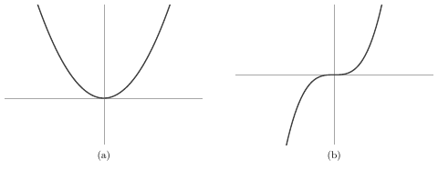</a> <a href="potencias.tex"><code>potencias</code></a></td>
<td align="center" width="25%"><a href="propiedad-supremo.pdf">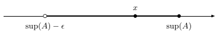</a> <a href="propiedad-supremo.tex"><code>propiedad-supremo</code></a></td>
<td align="center" width="25%"><a href="quintica.pdf">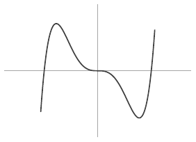</a> <a href="quintica.tex"><code>quintica</code></a></td>
</tr>
<tr>
<td align="center" width="25%"><a href="racionales-irracionales.pdf">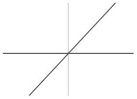</a> <a href="racionales-irracionales.tex"><code>racionales-irracionales</code></a></td>
<td align="center" width="25%"><a href="raices.pdf">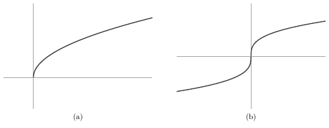</a> <a href="raices.tex"><code>raices</code></a></td>
<td align="center" width="25%"> <a href="raiz-mas-3.tex"><code>raiz-mas-3</code></a></td>
<td align="center" width="25%"> <a href="raiz-menos-3.tex"><code>raiz-menos-3</code></a></td>
</tr>
<tr>
<td align="center" width="25%"> <a href="raiz-reflejo-x.tex"><code>raiz-reflejo-x</code></a></td>
<td align="center" width="25%"> <a href="raiz-reflejo-y.tex"><code>raiz-reflejo-y</code></a></td>
<td align="center" width="25%"> <a href="raiz-x-mas-3.tex"><code>raiz-x-mas-3</code></a></td>
<td align="center" width="25%"> <a href="raiz-x-menos-3.tex"><code>raiz-x-menos-3</code></a></td>
</tr>
<tr>
<td align="center" width="25%"> <a href="reciproco.tex"><code>reciproco</code></a></td>
<td align="center" width="25%"> <a href="reciprocos.tex"><code>reciprocos</code></a></td>
<td align="center" width="25%"> <a href="recta.tex"><code>recta</code></a></td>
<td align="center" width="25%"> <a href="recta-tangente.tex"><code>recta-tangente</code></a></td>
</tr>
<tr>
<td align="center" width="25%"> <a href="rectangulo-inscrito.tex"><code>rectangulo-inscrito</code></a></td>
<td align="center" width="25%"> <a href="restriccion-parabola.tex"><code>restriccion-parabola</code></a></td>
<td align="center" width="25%"> <a href="semicircunferencias.tex"><code>semicircunferencias</code></a></td>
<td align="center" width="25%"> <a href="seno-extremos.tex"><code>seno-extremos</code></a></td>
</tr>
<tr>
<td align="center" width="25%"> <a href="seno-uno-entre-x.tex"><code>seno-uno-entre-x</code></a></td>
<td align="center" width="25%"> <a href="seno-x-tangente.tex"><code>seno-x-tangente</code></a></td>
<td align="center" width="25%"> <a href="sin-extremos.tex"><code>sin-extremos</code></a></td>
<td align="center" width="25%"> <a href="taylor-exponencial.tex"><code>taylor-exponencial</code></a></td>
</tr>
<tr>
<td align="center" width="25%"> <a href="transformacion-raiz.tex"><code>transformacion-raiz</code></a></td>
<td align="center" width="25%"> <a href="trigonometricas.tex"><code>trigonometricas</code></a></td>
<td align="center" width="25%"> <a href="valor-absoluto.tex"><code>valor-absoluto</code></a></td>
<td align="center" width="25%"> <a href="valor-medio.tex"><code>valor-medio</code></a></td>
</tr>
<tr>
<td align="center" width="25%"> <a href="valor-medio-generalizado.tex"><code>valor-medio-generalizado</code></a></td>
<td align="center" width="25%"> <a href="x-seno-uno-entre-x.tex"><code>x-seno-uno-entre-x</code></a></td>
<td align="center" width="25%"> <a href="x2-0-inf.tex"><code>x2-0-inf</code></a></td>
<td align="center" width="25%"> <a href="x2-abierto-cerrado.tex"><code>x2-abierto-cerrado</code></a></td>
</tr>
<tr>
<td align="center" width="25%"> <a href="x2-cerrado.tex"><code>x2-cerrado</code></a></td>
<td align="center" width="25%"> <a href="x2-cerrado-abierto.tex"><code>x2-cerrado-abierto</code></a></td>
<td align="center" width="25%"> <a href="x2-inf-0.tex"><code>x2-inf-0</code></a></td>
<td align="center" width="25%"> <a href="x2-seno-uno-entre-x.tex"><code>x2-seno-uno-entre-x</code></a></td>
</tr>
<tr>
<td align="center" width="25%"> <a href="x2-total.tex"><code>x2-total</code></a></td>
</tr>
</table>
