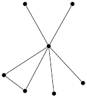
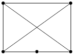
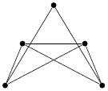
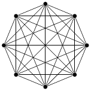
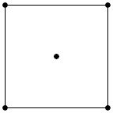
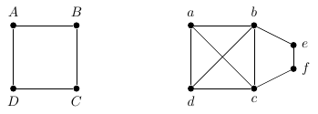
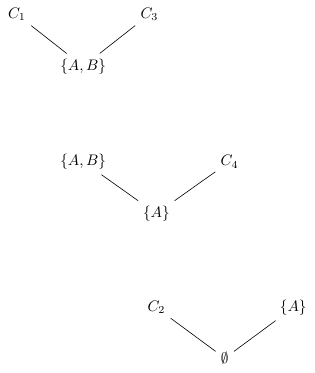
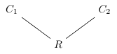
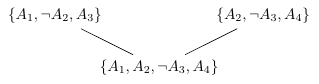

# Lógica

**10 figuras** · Origen: Notas de Lógica I

Grafos (incluido un $K_8$ con `\foreach`) y árboles de resolución proposicional con `positioning`.

Haz clic en una miniatura para abrir el PDF vectorial; el nombre lleva al código `.tex`.

[← Volver a la galería](../README.md)

<table>
<tr>
<td align="center" width="25%"> <a href="grafo-1.tex"><code>grafo-1</code></a></td>
<td align="center" width="25%"> <a href="grafo-2.tex"><code>grafo-2</code></a></td>
<td align="center" width="25%"> <a href="grafo-3.tex"><code>grafo-3</code></a></td>
<td align="center" width="25%"> <a href="grafo-4.tex"><code>grafo-4</code></a></td>
</tr>
<tr>
<td align="center" width="25%"> <a href="grafo-5.tex"><code>grafo-5</code></a></td>
<td align="center" width="25%"> <a href="grafos-encaje.tex"><code>grafos-encaje</code></a></td>
<td align="center" width="25%"> <a href="resolucion-cadena.tex"><code>resolucion-cadena</code></a></td>
<td align="center" width="25%"> <a href="resolvente-definicion.tex"><code>resolvente-definicion</code></a></td>
</tr>
<tr>
<td align="center" width="25%"> <a href="resolvente-ejemplo1.tex"><code>resolvente-ejemplo1</code></a></td>
<td align="center" width="25%"> <a href="resolvente-ejemplo2.tex"><code>resolvente-ejemplo2</code></a></td>
</tr>
</table>
