# Teoría analítica de números

**21 figuras** · Origen: Notas sobre *Introduction to Analytic Number Theory* (Apostol)

Contornos de integración con orientación (`decorations.markings`), retículas de puntos generadas con `\foreach` y regiones sombreadas bajo hipérbolas.

Haz clic en una miniatura para abrir el PDF vectorial; el nombre lleva al código `.tex`.

[← Volver a la galería](../README.md)

<table>
<tr>
<td align="center" width="25%"><a href="figura11-1.pdf">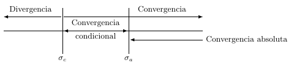</a> <a href="figura11-1.tex"><code>figura11-1</code></a></td>
<td align="center" width="25%"><a href="figura11-2.pdf">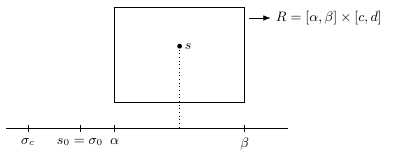</a> <a href="figura11-2.tex"><code>figura11-2</code></a></td>
<td align="center" width="25%"><a href="figura11-3.pdf">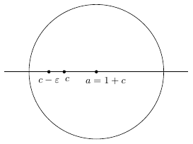</a> <a href="figura11-3.tex"><code>figura11-3</code></a></td>
<td align="center" width="25%"><a href="figura11-4.pdf">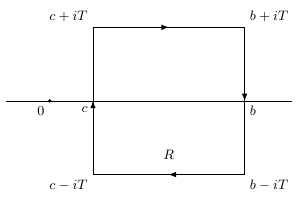</a> <a href="figura11-4.tex"><code>figura11-4</code></a></td>
</tr>
<tr>
<td align="center" width="25%"><a href="figura11-5.pdf">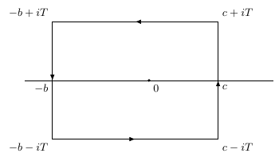</a> <a href="figura11-5.tex"><code>figura11-5</code></a></td>
<td align="center" width="25%"><a href="figura12-1.pdf">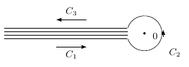</a> <a href="figura12-1.tex"><code>figura12-1</code></a></td>
<td align="center" width="25%"><a href="figura12-2.pdf">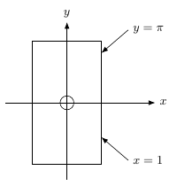</a> <a href="figura12-2.tex"><code>figura12-2</code></a></td>
<td align="center" width="25%"><a href="figura12-3.pdf">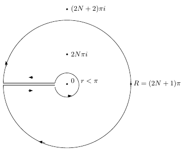</a> <a href="figura12-3.tex"><code>figura12-3</code></a></td>
</tr>
<tr>
<td align="center" width="25%"><a href="figura13-1.pdf">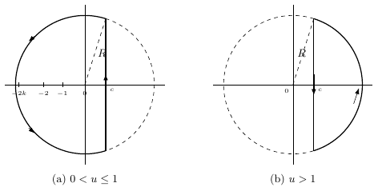</a> <a href="figura13-1.tex"><code>figura13-1</code></a></td>
<td align="center" width="25%"><a href="figura13-2.pdf">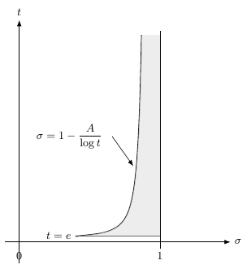</a> <a href="figura13-2.tex"><code>figura13-2</code></a></td>
<td align="center" width="25%"><a href="figura13-3.pdf">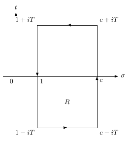</a> <a href="figura13-3.tex"><code>figura13-3</code></a></td>
<td align="center" width="25%"><a href="figura14-1.pdf">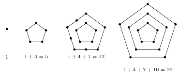</a> <a href="figura14-1.tex"><code>figura14-1</code></a></td>
</tr>
<tr>
<td align="center" width="25%"><a href="figura14-2.pdf">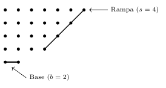</a> <a href="figura14-2.tex"><code>figura14-2</code></a></td>
<td align="center" width="25%"><a href="figura14-3.pdf">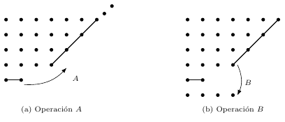</a> <a href="figura14-3.tex"><code>figura14-3</code></a></td>
<td align="center" width="25%"><a href="figura14-4.pdf">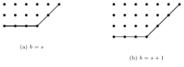</a> <a href="figura14-4.tex"><code>figura14-4</code></a></td>
<td align="center" width="25%"><a href="figura3-1.pdf">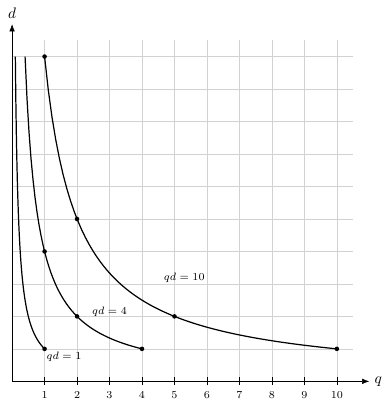</a> <a href="figura3-1.tex"><code>figura3-1</code></a></td>
</tr>
<tr>
<td align="center" width="25%"><a href="figura3-2.pdf">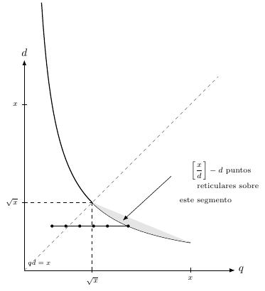</a> <a href="figura3-2.tex"><code>figura3-2</code></a></td>
<td align="center" width="25%"><a href="figura3-3.pdf">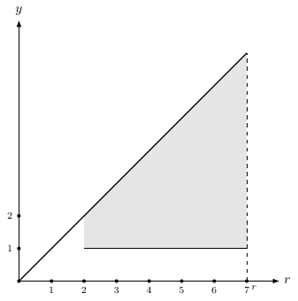</a> <a href="figura3-3.tex"><code>figura3-3</code></a></td>
<td align="center" width="25%"><a href="figura3-4.pdf">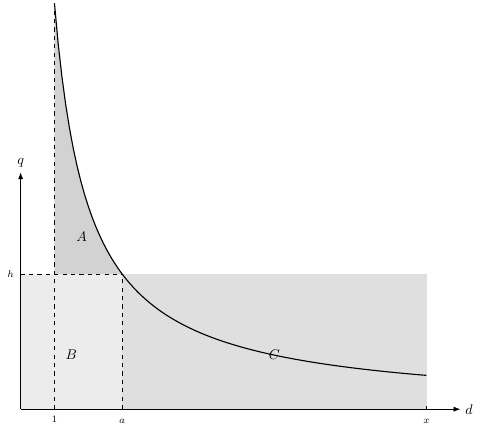</a> <a href="figura3-4.tex"><code>figura3-4</code></a></td>
<td align="center" width="25%"><a href="figura9-1.pdf">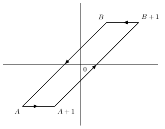</a> <a href="figura9-1.tex"><code>figura9-1</code></a></td>
</tr>
<tr>
<td align="center" width="25%"><a href="figura9-2.pdf">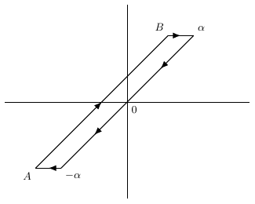</a> <a href="figura9-2.tex"><code>figura9-2</code></a></td>
</tr>
</table>
