# Termodinámica

**45 figuras** · Origen: Notas de Termodinámica

Diagramas físicos en **TikZ** (cilindros, pistones, paredes adiabáticas con `patterns`, resortes y solenoides con `decorations.pathmorphing`) y superficies de equilibrio en 3D con `\addplot3[surf]`.

Haz clic en una miniatura para abrir el PDF vectorial; el nombre lleva al código `.tex`.

[← Volver a la galería](../README.md)

<table>
<tr>
<td align="center" width="25%"><a href="PV-ejemplo.pdf">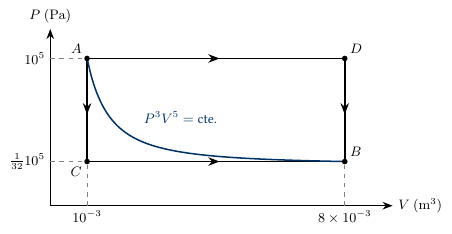</a> <a href="PV-ejemplo.tex"><code>PV-ejemplo</code></a></td>
<td align="center" width="25%"><a href="PV-trayectorias.pdf">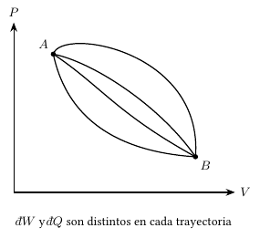</a> <a href="PV-trayectorias.tex"><code>PV-trayectorias</code></a></td>
<td align="center" width="25%"><a href="S-U-dostercios.pdf">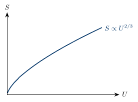</a> <a href="S-U-dostercios.tex"><code>S-U-dostercios</code></a></td>
<td align="center" width="25%"><a href="S-U-mitad.pdf">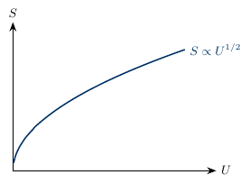</a> <a href="S-U-mitad.tex"><code>S-U-mitad</code></a></td>
</tr>
<tr>
<td align="center" width="25%"><a href="S-U-tercio.pdf">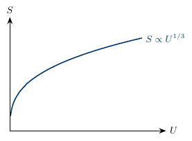</a> <a href="S-U-tercio.tex"><code>S-U-tercio</code></a></td>
<td align="center" width="25%"><a href="U-S-T.pdf">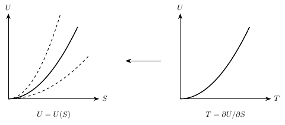</a> <a href="U-S-T.tex"><code>U-S-T</code></a></td>
<td align="center" width="25%"><a href="cajas-entropia.pdf">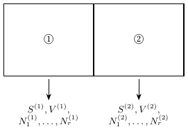</a> <a href="cajas-entropia.tex"><code>cajas-entropia</code></a></td>
<td align="center" width="25%"><a href="camino-PT.pdf">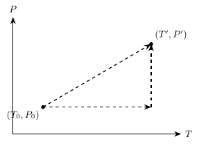</a> <a href="camino-PT.tex"><code>camino-PT</code></a></td>
</tr>
<tr>
<td align="center" width="25%"><a href="cavidad-resonante.pdf">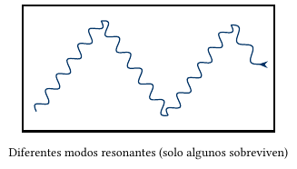</a> <a href="cavidad-resonante.tex"><code>cavidad-resonante</code></a></td>
<td align="center" width="25%"><a href="cilindro-compuesto.pdf">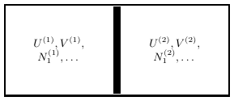</a> <a href="cilindro-compuesto.tex"><code>cilindro-compuesto</code></a></td>
<td align="center" width="25%"><a href="cilindro-pistones.pdf">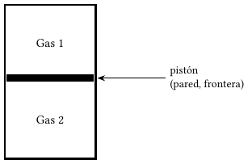</a> <a href="cilindro-pistones.tex"><code>cilindro-pistones</code></a></td>
<td align="center" width="25%"><a href="composicion.pdf">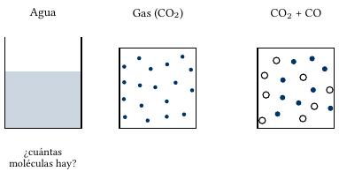</a> <a href="composicion.tex"><code>composicion</code></a></td>
</tr>
<tr>
<td align="center" width="25%"><a href="cuasiestatico.pdf">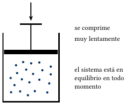</a> <a href="cuasiestatico.tex"><code>cuasiestatico</code></a></td>
<td align="center" width="25%"><a href="curva-Y.pdf">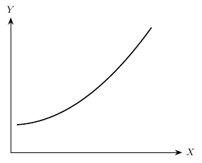</a> <a href="curva-Y.tex"><code>curva-Y</code></a></td>
<td align="center" width="25%"><a href="dipolo.pdf">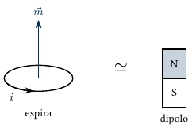</a> <a href="dipolo.tex"><code>dipolo</code></a></td>
<td align="center" width="25%"><a href="esfera-proyeccion.pdf">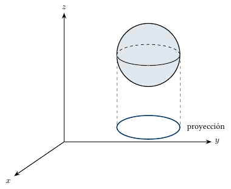</a> <a href="esfera-proyeccion.tex"><code>esfera-proyeccion</code></a></td>
</tr>
<tr>
<td align="center" width="25%"><a href="extensivos-U.pdf">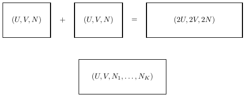</a> <a href="extensivos-U.tex"><code>extensivos-U</code></a></td>
<td align="center" width="25%"><a href="extensivos-V.pdf">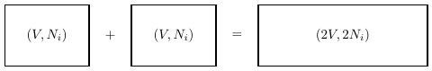</a> <a href="extensivos-V.tex"><code>extensivos-V</code></a></td>
<td align="center" width="25%"><a href="familia-curvas.pdf">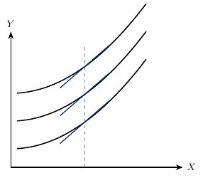</a> <a href="familia-curvas.tex"><code>familia-curvas</code></a></td>
<td align="center" width="25%"><a href="gas-recipiente.pdf">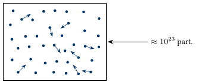</a> <a href="gas-recipiente.tex"><code>gas-recipiente</code></a></td>
</tr>
<tr>
<td align="center" width="25%"><a href="hipersuperficie-tangente.pdf">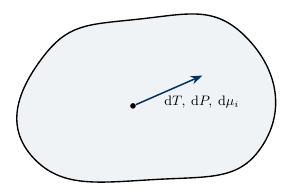</a> <a href="hipersuperficie-tangente.tex"><code>hipersuperficie-tangente</code></a></td>
<td align="center" width="25%"><a href="isotermas.pdf">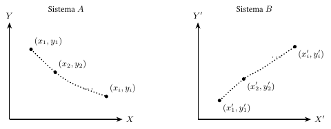</a> <a href="isotermas.tex"><code>isotermas</code></a></td>
<td align="center" width="25%"><a href="ley-cero.pdf">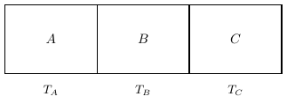</a> <a href="ley-cero.tex"><code>ley-cero</code></a></td>
<td align="center" width="25%"><a href="pared-adiabatica.pdf">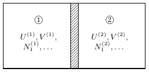</a> <a href="pared-adiabatica.tex"><code>pared-adiabatica</code></a></td>
</tr>
<tr>
<td align="center" width="25%"><a href="pared-diatermica-movil.pdf">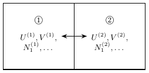</a> <a href="pared-diatermica-movil.tex"><code>pared-diatermica-movil</code></a></td>
<td align="center" width="25%"><a href="pared-impermeable.pdf">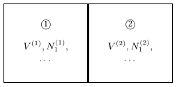</a> <a href="pared-impermeable.tex"><code>pared-impermeable</code></a></td>
<td align="center" width="25%"><a href="pared-permeable.pdf">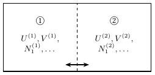</a> <a href="pared-permeable.tex"><code>pared-permeable</code></a></td>
<td align="center" width="25%"><a href="plano-S0.pdf">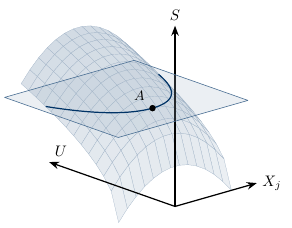</a> <a href="plano-S0.tex"><code>plano-S0</code></a></td>
</tr>
<tr>
<td align="center" width="25%"><a href="plano-U0.pdf">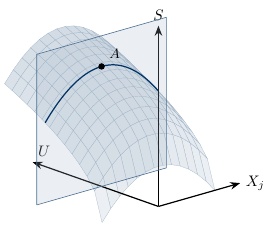</a> <a href="plano-U0.tex"><code>plano-U0</code></a></td>
<td align="center" width="25%"><a href="polimero.pdf">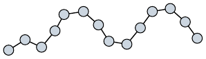</a> <a href="polimero.tex"><code>polimero</code></a></td>
<td align="center" width="25%"><a href="pozo-potencial.pdf">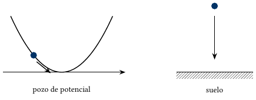</a> <a href="pozo-potencial.tex"><code>pozo-potencial</code></a></td>
<td align="center" width="25%"><a href="procesos-AB.pdf">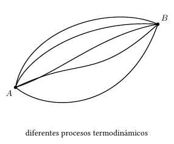</a> <a href="procesos-AB.tex"><code>procesos-AB</code></a></td>
</tr>
<tr>
<td align="center" width="25%"><a href="region-TP.pdf">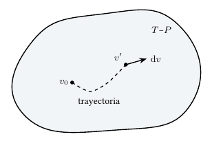</a> <a href="region-TP.tex"><code>region-TP</code></a></td>
<td align="center" width="25%"><a href="seis-subsistemas.pdf">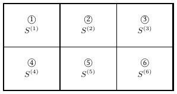</a> <a href="seis-subsistemas.tex"><code>seis-subsistemas</code></a></td>
<td align="center" width="25%"><a href="sistema-compuesto.pdf">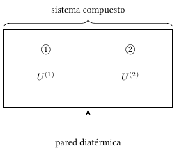</a> <a href="sistema-compuesto.tex"><code>sistema-compuesto</code></a></td>
<td align="center" width="25%"><a href="solenoide.pdf">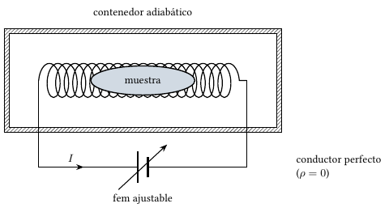</a> <a href="solenoide.tex"><code>solenoide</code></a></td>
</tr>
<tr>
<td align="center" width="25%"><a href="sup-cuasiestatico.pdf">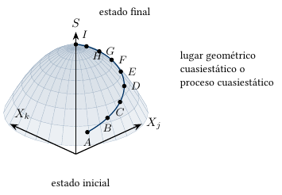</a> <a href="sup-cuasiestatico.tex"><code>sup-cuasiestatico</code></a></td>
<td align="center" width="25%"><a href="sup-equilibrio.pdf">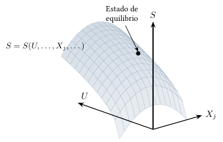</a> <a href="sup-equilibrio.tex"><code>sup-equilibrio</code></a></td>
<td align="center" width="25%"><a href="sup-reversible.pdf">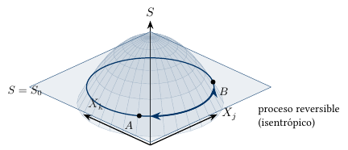</a> <a href="sup-reversible.tex"><code>sup-reversible</code></a></td>
<td align="center" width="25%"><a href="tangente-psi.pdf">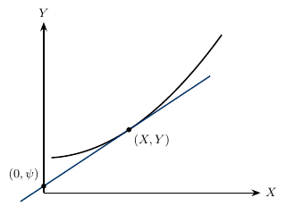</a> <a href="tangente-psi.tex"><code>tangente-psi</code></a></td>
</tr>
<tr>
<td align="center" width="25%"><a href="tangentes.pdf">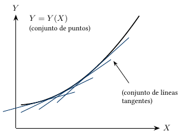</a> <a href="tangentes.tex"><code>tangentes</code></a></td>
<td align="center" width="25%"><a href="temperaturas-iguales.pdf">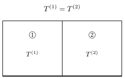</a> <a href="temperaturas-iguales.tex"><code>temperaturas-iguales</code></a></td>
<td align="center" width="25%"><a href="tipos-sistemas.pdf">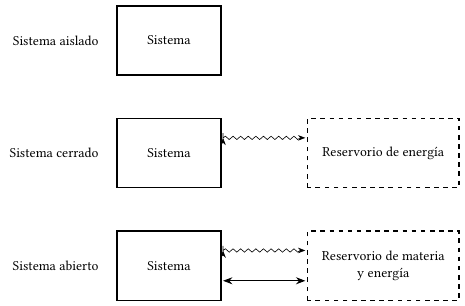</a> <a href="tipos-sistemas.tex"><code>tipos-sistemas</code></a></td>
<td align="center" width="25%"><a href="trabajo-adiabatico.pdf">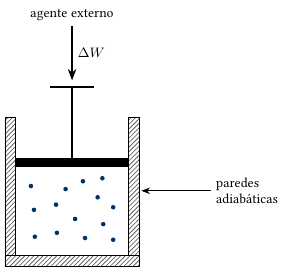</a> <a href="trabajo-adiabatico.tex"><code>trabajo-adiabatico</code></a></td>
</tr>
<tr>
<td align="center" width="25%"><a href="tres-cilindros.pdf">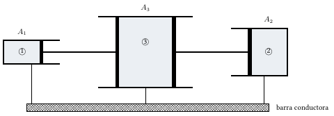</a> <a href="tres-cilindros.tex"><code>tres-cilindros</code></a></td>
</tr>
</table>
