# Funciones trigonométricas e inversas

**12 figuras** · Origen: Tarea 11 de Cálculo I (primer semestre)

Las seis funciones trigonométricas restringidas y sus inversas en **PGFPlots**, con marcas de ticks en múltiplos de π y asíntotas punteadas. Las extraje del documento original a archivos standalone.

Haz clic en una miniatura para abrir el PDF vectorial; el nombre lleva al código `.tex`.

[← Volver a la galería](../README.md)

<table>
<tr>
<td align="center" width="25%"><a href="arcocosecante.pdf">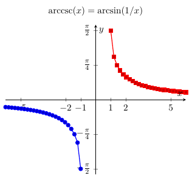</a> <a href="arcocosecante.tex"><code>arcocosecante</code></a></td>
<td align="center" width="25%"><a href="arcocoseno.pdf">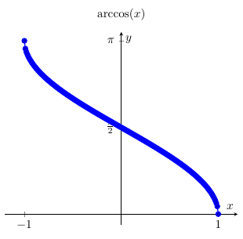</a> <a href="arcocoseno.tex"><code>arcocoseno</code></a></td>
<td align="center" width="25%"><a href="arcocotangente.pdf">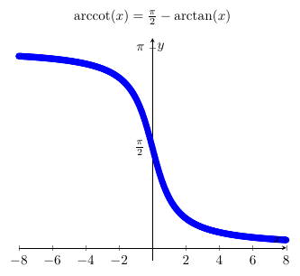</a> <a href="arcocotangente.tex"><code>arcocotangente</code></a></td>
<td align="center" width="25%"><a href="arcosecante.pdf">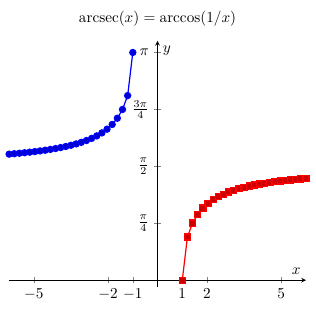</a> <a href="arcosecante.tex"><code>arcosecante</code></a></td>
</tr>
<tr>
<td align="center" width="25%"><a href="arcoseno.pdf">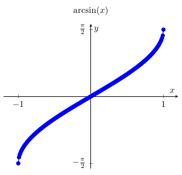</a> <a href="arcoseno.tex"><code>arcoseno</code></a></td>
<td align="center" width="25%"><a href="arcotangente.pdf">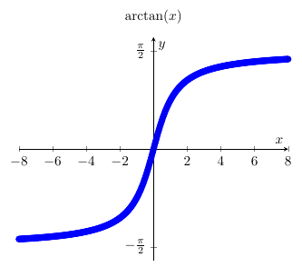</a> <a href="arcotangente.tex"><code>arcotangente</code></a></td>
<td align="center" width="25%"><a href="cosecante.pdf">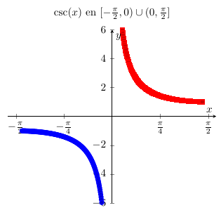</a> <a href="cosecante.tex"><code>cosecante</code></a></td>
<td align="center" width="25%"><a href="coseno.pdf">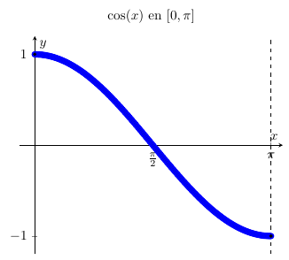</a> <a href="coseno.tex"><code>coseno</code></a></td>
</tr>
<tr>
<td align="center" width="25%"><a href="cotangente.pdf">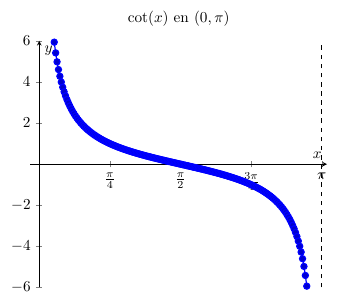</a> <a href="cotangente.tex"><code>cotangente</code></a></td>
<td align="center" width="25%"><a href="secante.pdf">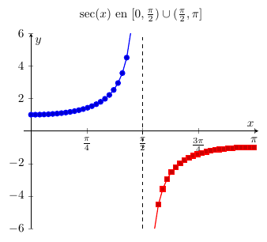</a> <a href="secante.tex"><code>secante</code></a></td>
<td align="center" width="25%"><a href="seno.pdf">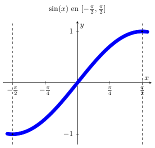</a> <a href="seno.tex"><code>seno</code></a></td>
<td align="center" width="25%"><a href="tangente.pdf">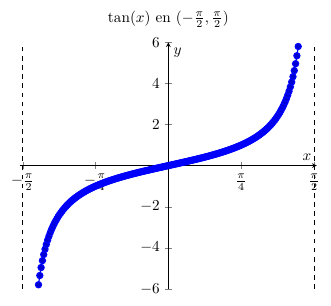</a> <a href="tangente.tex"><code>tangente</code></a></td>
</tr>
</table>
