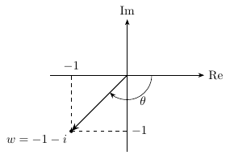
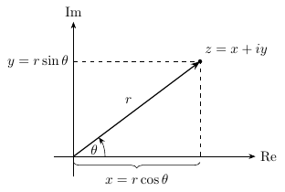
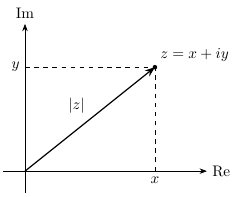
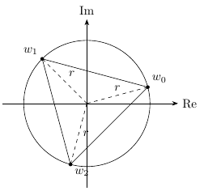
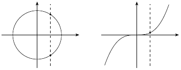
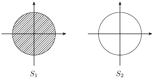
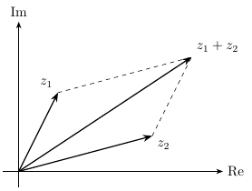

# Variable compleja

**7 figuras** · Origen: Notas de Análisis matemático

El plano complejo: forma polar, argumento, raíces cúbicas y regiones (disco, círculo) con `patterns`.

Haz clic en una miniatura para abrir el PDF vectorial; el nombre lleva al código `.tex`.

[← Volver a la galería](../README.md)

<table>
<tr>
<td align="center" width="25%"> <a href="argumento-w.tex"><code>argumento-w</code></a></td>
<td align="center" width="25%"> <a href="forma-polar.tex"><code>forma-polar</code></a></td>
<td align="center" width="25%"> <a href="plano-complejo.tex"><code>plano-complejo</code></a></td>
<td align="center" width="25%"> <a href="raices-cubicas.tex"><code>raices-cubicas</code></a></td>
</tr>
<tr>
<td align="center" width="25%"> <a href="recta-vertical.tex"><code>recta-vertical</code></a></td>
<td align="center" width="25%"> <a href="relaciones-disco-circulo.tex"><code>relaciones-disco-circulo</code></a></td>
<td align="center" width="25%"> <a href="suma-vectores.tex"><code>suma-vectores</code></a></td>
</tr>
</table>
